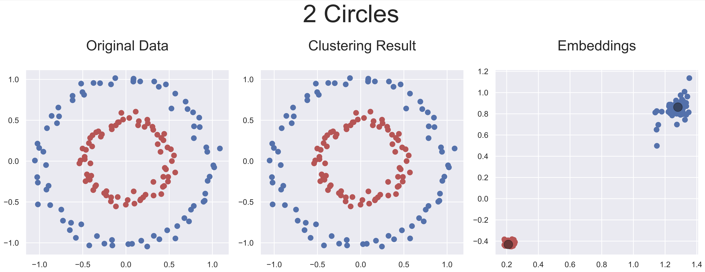
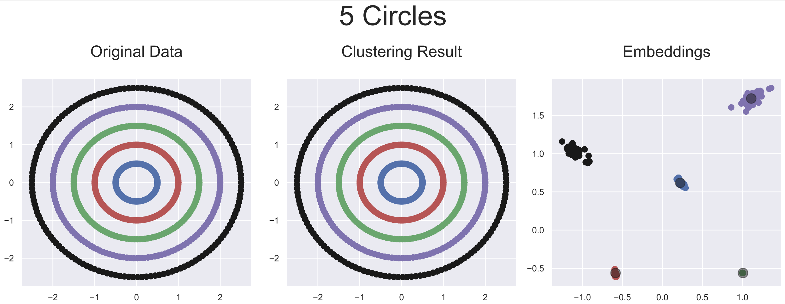
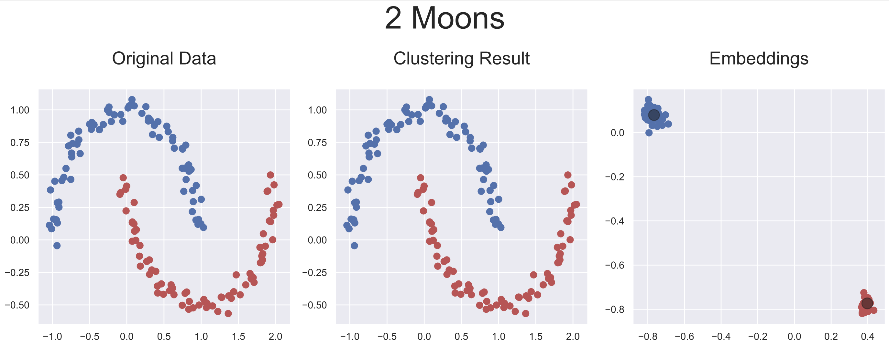
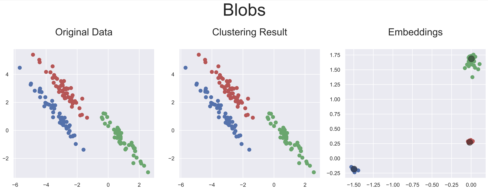
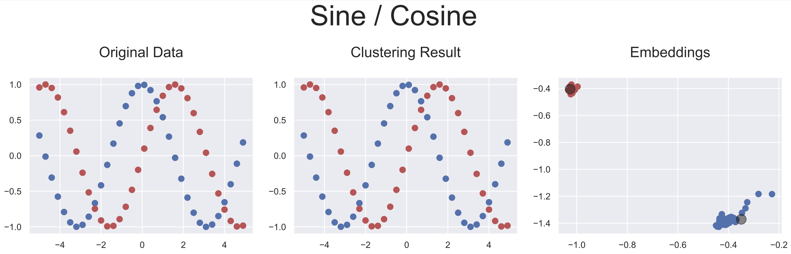
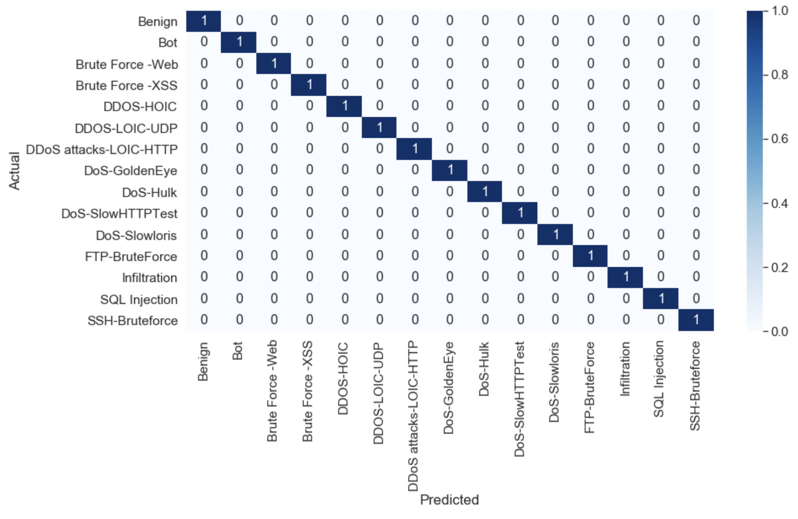

# ACID - Adaptive Clustering based Intrusion Detection

_PyTorch Implementation + Code Templates_
<hr />

The approach implemented here aims to maximize the performance of 
machine learning classifiers by relying on optimal low-dimensional
 embeddings learned from a deep-learning based clustering network.

This repository is only intended to help researchers understand and learn to use the approach presented in our paper:
[Adaptive Clustering-based Malicious Traffic Classification at the Network 
Edge](https://homepages.inf.ed.ac.uk/ppatras/pub/infocom21.pdf). 
It is therefore important to note that the architectures of the neural networks used, as well as the hyper-parameters,
can be subject to change depending on the task at hand.

In this basic implementation, only feed-forward networks are employed.

## Getting Started
These instructions will get you a copy of the project up and running on your local machine for 
development and testing purposes.

### Cloning the repository
Clone the project to have a copy in your desired local repository

> `git clone https://github.com/Mobile-Intelligence-Lab/ACID.git [LOCAL_DIRECTORY_PATH]`

### Installing dependencies
Use pip installation to install dependencies from requirements.txt

> `pip install -r requirements.txt`

### Usage
_(Default architecture)_

```python
from core.models.network import AdaptiveClustering
from torch.optim import Adam
import numpy as np
...
model = AdaptiveClustering(
    encoder_dims=[100, 50, 10], # neurons per hidden layer (for mlp)
    n_kernels=NUM_CLASSES, 
    kernel_size=EMBEDDIMG_DIMENSION
)

# Training...
optimizer = None
for _ in range(NUM_EPOCHS):
    for _, (x, y) in enumerate(data_loader):
        model.zero_grad()
        outputs = model(x, y)
        
        if optimizer is None:
            optimizer = Adam(model.parameters(), lr=LEARNING_RATE)
        
        loss = model.loss()
        loss.backward()
        optimizer.step()
...

# Inference...
outputs = model(x).max(dim=1).indices.squeeze().tolist()

# Embeddings...
encoded_repr = np.stack([model.sub_nets[output_class].encoder(x[i]).tolist()
                         for i, output_class in enumerate(outputs)]).squeeze()

# Cluster centers...
cluster_centers = np.asarray([model.sub_nets[i].kernel_weights.squeeze().tolist()
                              for i in range(model.n_kernels_)])

```

_(Clustering experiments)_
* Adaptive Clustering Network:
> `python demo/clustering/acnet.py [-h]`

* Baseline methods:
  + k-Means 
    > `python demo/clustering/kmeans.py [-h]`
  + DBSCAN 
    > `python demo/clustering/dbscan.py [-h]`
  + Spectral Clustering
    > `python demo/clustering/spectral.py [-h]`

## Clustering Results
Five artificially generated datasets were used to evaluate the adaptability of this 
approach to different ranges of data configuration. As our approach provides latent 
representations of the inputs, it is rather simple to visualize each step of the 
inputs' transformations leading to the optimal latent representations obtained by AC-Net.

Below are plotted the final embeddings obtained with the artificial datasets used 
in the [paper](https://homepages.inf.ed.ac.uk/ppatras/pub/infocom21.pdf).

The source codes for reproducing these results, as well as the baseline methods'
can be found [here](./demo/clustering).


### Visualization of how AC-Net affects the inputs
#### Concentric circles  (Complexity level: Medium)

> `python demo/clustering/acnet.py --2-circles`



> `python demo/clustering/acnet.py --5-circles`



#### Interleaved boundaries (Complexity level: Medium)

> `python demo/clustering/acnet.py --2-moons`



#### Linear boundaries (Complexity level: Low)

> `python demo/clustering/acnet.py --blobs`



#### Intertwined boundaries (Complexity level: High)

> `python demo/clustering/acnet.py --sine-cosine`




## Network Intrusion Detection
As practical use-cases, AC-Net was used on three network intrusion detection datasets:
KDD Cup’99 [\[1\]](#references), ISCX-IDS 2012 [\[2\]](#references), and CSE-CIC-IDS 2018 [\[3\]](#references).


### ACID performance on the CSE-CIC-IDS 2018
_(Dataset extended with "payload features" as mentioned in the 
[paper](https://homepages.inf.ed.ac.uk/ppatras/pub/infocom21.pdf))_

A _notebook_ including a step-by-step tutorial is provided here:
[.ipynb](./IDS.ipynb) | [.html (with traces)](./IDS.html).



## Citation
<pre><code>@inproceedings{,
  author = {Alec F. Diallo and Paul Patras},
  title = {Adaptive Clustering for Lightweight Malicious Traffic Classification at the Edge},
  booktitle = "IEEE INFOCOM 2021",
  year = {2021},
  month = {05}
}</code></pre>


## References

[1] [http://kdd.ics.uci.edu/databases/kddcup99/kddcup99.html](http://kdd.ics.uci.edu/databases/kddcup99/kddcup99.html)

[2] [https://www.unb.ca/cic/datasets/ids.html](https://www.unb.ca/cic/datasets/ids.html)

[3] [https://www.unb.ca/cic/datasets/ids-2018.html](https://www.unb.ca/cic/datasets/ids-2018.html)
